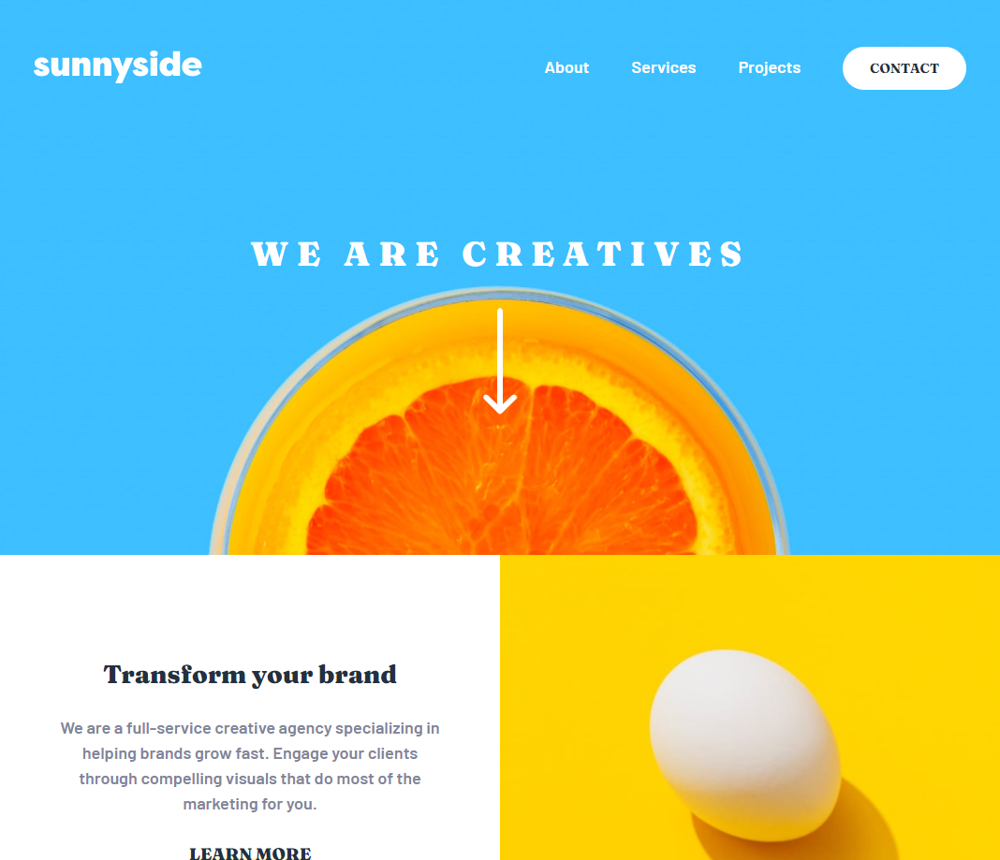

# Frontend Mentor - Sunnyside agency landing page solution

This is a solution to the [Sunnyside agency landing page challenge on Frontend Mentor](https://www.frontendmentor.io/challenges/sunnyside-agency-landing-page-7yVs3B6ef). Frontend Mentor challenges help you improve your coding skills by building realistic projects.

## Table of contents

- [Overview](#overview)
  - [The challenge](#the-challenge)
  - [Screenshot](#screenshot)
  - [Links](#links)
- [Built with](#built-with)
- [Author](#author)

## Overview

### The challenge

Users should be able to:

- View the optimal layout for the site depending on their device's screen size
- See hover states for interactive elements on the page

### Screenshot

### Links

- [GitHub project URL](https://github.com/tamastomordi/sunnyside-agency-landing-page)
- [Live site URL](https://friendly-almeida-31368d.netlify.app)

## Built with

- Semantic HTML5 markup
- SCSS
- CSS custom properties
- Flexbox
- CSS Grid
- Mobile-first workflow
- [Modern CSS Reset](https://github.com/andy-piccalilli/modern-css-reset) by Andy Piccalilli

## Author

- Tamás Tömördi - [tomordi.com](https://www.tomordi.com)
